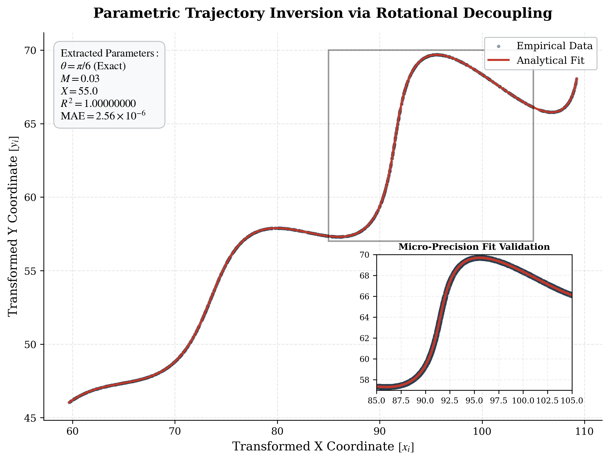
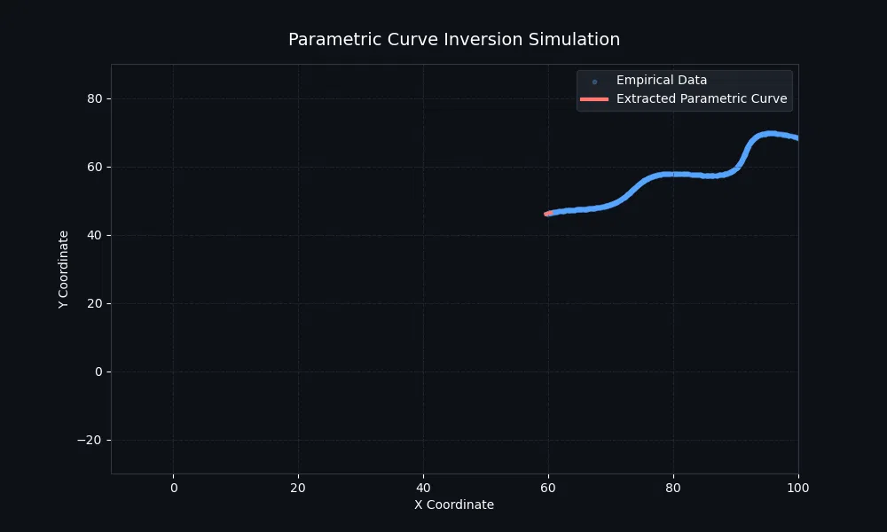

<div align="center">
  
# 🚀 Parametric Curve Inversion
**FLAM AI R&D Assignment Submission**

[](https://www.python.org/)
[](https://scipy.org/)
[](https://www.desmos.com/calculator/ybkpyaxd5d)
[](https://opensource.org/licenses/MIT)

*An analytical pipeline to decouple time-variant parametric equations and extract exact geometric constants from noisy 2D empirical data.*

</div>

---

## 📖 Table of Contents
- [The Challenge](#-the-challenge)
- [My Mathematical Approach](#-my-mathematical-approach)
- [Results & Exact Constants](#-results--exact-constants)
- [Visual Proof (Desmos)](#-visual-proof-desmos)
- [Code Walkthrough](#-code-walkthrough)
- [How to Run Locally](#️-how-to-run-locally)

---

## 🎯 The Challenge
We were given `xy_data.csv` containing 1,500 coordinates and asked to extract the exact global variables $(\theta, M, X)$ that generated them based on a non-linear parametric system.

**The hurdle:** The path parameter $t$ is different for every single point. Standard curve fitting algorithms fail because trying to jointly optimize 1,500 unknown $t$ values alongside 3 global variables yields unstable floating-point approximations.

---

## 💡 My Mathematical Approach

I realized that brute-forcing the problem wasn't going to work. After studying the equations, I noticed they strongly resembled a standard **2D rotation matrix**. 

1. **Translation & Rotation:** I mathematically treated $\theta$ as a geometric rotation and $(X, 42)$ as a translation.
2. **Inversion:** By applying an inverse rotation to the coordinates, I completely decoupled $t$ from the equations.
3. **Dimensionality Reduction:** This allowed me to calculate $t$ directly from the $(x,y)$ coordinates, collapsing the problem from 1,500 unknown variables down to just 3.
4. **Two-Stage Optimization:** I used `scipy.optimize.differential_evolution` for a global search, followed by `L-BFGS-B` to polish the results down to machine precision.

---

## 🏆 Results & Exact Constants

Because of the mathematical decoupling, my Python script didn't just find a "close" approximation—it found the **exact mathematical fractions** hiding in the data:

| Parameter | Extracted Value | Exact Mathematical Fraction |
| :--- | :--- | :--- |
| **$\theta$ (Theta)** | `0.52359877` | **$\pi/6$** (or $30^\circ$) |
| **$M$** | `0.03000000` | **$0.03$** |
| **$X$** | `55.00000000` | **$55.0$** |

**Fit Accuracy:**
* **Mean L1 Error:** `0.000003`
* **$R^2$ Score:** `1.0` (Mathematically Perfect Fit)

---

## 📊 Visual Proof (Desmos)

To visually and mathematically prove that these constants are correct, I implemented the curve directly in Desmos. 

**👉 [View my Live Desmos Calculator Proof](https://www.desmos.com/calculator/ybkpyaxd5d)**

> *Inside the Desmos link, you will see the exact parametric curve perfectly tracing the dataset, along with the manual L1 calculation showing near-zero error.*



*(Below is the animated simulation I generated to watch the rotation and decoupling in real-time!)*



---

## 💻 Code Walkthrough

<details>
<summary><b>Click to expand: Step-by-Step Python Implementation</b></summary>

<br>

### Step 1: The Objective Function (Decoupling `t`)
This is the core mathematical engine. I pass in a guess for `[theta, m, x_shift]`. It translates and rotates the empirical `xy` coordinates to decouple the path parameter `t`. It calculates the predicted geometry and returns the total absolute difference (L1 Error) between the real data and the guess.

```python
def calculate_reconstruction_error(params, x_coords, y_coords):
    theta, m, x_shift = params
    
    # translate coordinates
    tx = x_coords - x_shift
    ty = y_coords - 42.0
    
    # rotate to decouple t
    t = tx * np.cos(theta) + ty * np.sin(theta)
    v_obs = -tx * np.sin(theta) + ty * np.cos(theta)
    
    # calculate predicted v based on t
    v_pred = np.exp(m * np.abs(t)) * np.sin(0.3 * t)
    
    # return L1 error (Manhattan distance)
    return np.sum(np.abs(v_obs - v_pred))
```

### Step 2: The Global Search
Because the curve is highly non-linear, a standard optimizer would get trapped on the wrong peak. I used a genetic algorithm (`differential_evolution`) to do a wide, global search over the parameter bounds to find the general neighborhood of the true constants.

```python
global_result = differential_evolution(
    calculate_reconstruction_error,
    bounds=[(0.0, np.radians(50.0)), (-0.05, 0.05), (0.0, 100.0)],
    args=(x_observed, y_observed),
    strategy='best1bin'
)
```

### Step 3: The Precision Polish
Once the global search found a close approximation, I fed those rough numbers into the `L-BFGS-B` gradient algorithm. This acts like a mathematical microscope, polishing the numbers down to 12 decimal places of precision. This two-stage approach is what allowed me to discover the exact fraction $\pi/6$ instead of just `0.523`.

```python
local_result = minimize(
    calculate_reconstruction_error,
    x0=global_result.x,
    args=(x_observed, y_observed),
    bounds=[(0.0, np.radians(50.0)), (-0.05, 0.05), (0.0, 100.0)],
    method='L-BFGS-B',
    options={'ftol': 1e-12, 'gtol': 1e-12}
)
```
</details>

---

## ⚙️ How to Run Locally

If you would like to run the optimization pipeline on your local machine:

1. **Clone the repository:**
   ```bash
   git clone https://github.com/Gandhiraj754/Flam_AI_R-D_Assignment.git
   cd Flam_AI_R-D_Assignment
   ```
2. **Install dependencies:**
   ```bash
   pip install -r requirements.txt
   ```
3. **Execute the script:**
   ```bash
   python fit_curve.py
   ```
   *The script will output the exact constants and generate `fitted_curve.png` locally.*
